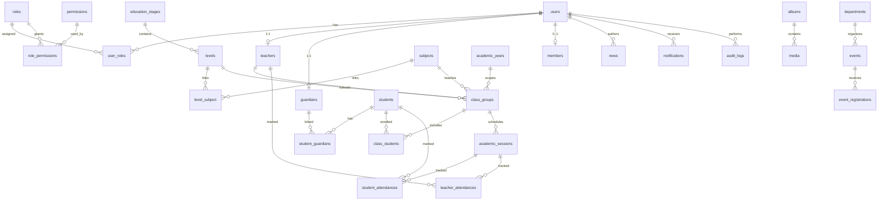

# RDP — ERD Phase 2

Schéma relationnel de la plateforme **رابطة الجالية السودانية برين** (RDP).  
SGBD local : MySQL 8 / InnoDB (`utf8mb4`).

## Principes

- Comptes d’accès dans `users` ; profils métier liés (`teachers`, `guardians`, `members`).
- RBAC : `roles` + `permissions` + pivots.
- Contenu bilingue : champs `*_ar` / `*_fr`.
- Une seule année académique `active` à la fois (règle applicative).
- Soft-delete (`deleted_at`) sur les entités métier sensibles.
- Traçabilité via `audit_logs` ; consentements RGPD via `consents`.

## Diagramme (vue d’ensemble)

## Domaines & tables

### 1. Accès & RBAC

| Table | Rôle |
|---|---|
| `users` | Authentification (email/password), locale, statut |
| `roles` | SUPER_ADMIN, PRESIDENT, TEACHER, PARENT… |
| `permissions` | `user.view`, `student.create`, `report.export`… |
| `user_roles` | Pivot user ↔ role |
| `role_permissions` | Pivot role ↔ permission |

### 2. Organisation

| Table | Rôle |
|---|---|
| `departments` | أمانات / secrétariats |
| `members` | Membres de la Rabta + workflow Pending→Active |

### 3. Académique (référentiel)

| Table | Rôle |
|---|---|
| `academic_years` | 2026/2027 — Preparation / Active / Closed |
| `education_stages` | Primaire, Collège, Lycée |
| `levels` | CP, CE1… liés à une stage |
| `subjects` | العربية، قرآن، Math… |
| `level_subject` | Matières disponibles par niveau |

### 4. Personnes

| Table | Rôle |
|---|---|
| `teachers` | Profil enseignant lié à `users` |
| `guardians` | Parents / tuteurs |
| `students` | Élèves |
| `student_guardians` | N-N élève ↔ parent (+ relation) |

### 5. Classes & présence

| Table | Rôle |
|---|---|
| `class_groups` | Ex. « CE2 Arabic A » |
| `class_students` | Inscriptions (enrollments) |
| `academic_sessions` | Séances datées |
| `student_attendances` | Present / Absent / Late / Excused |
| `teacher_attendances` | Présence enseignants |

### 6. Contenu & médias

| Table | Rôle |
|---|---|
| `news` | Draft / Published |
| `events` | Planned → Completed / Cancelled |
| `event_registrations` | Inscriptions aux événements |
| `albums` | Galeries |
| `media` | Fichiers/photos d’un album |
| `documents` | Docs internes (visibilité) |

### 7. Système & conformité

| Table | Rôle |
|---|---|
| `notifications` | Centre de notifications |
| `consents` | Consentements RGPD |
| `audit_logs` | Actions sensibles |

## Enums principaux

| Entité | Valeurs |
|---|---|
| `users.status` | active, inactive, suspended |
| `members.status` | pending, active, suspended, inactive, rejected |
| `academic_years.status` | preparation, active, closed |
| `students.status` | pending, under_review, accepted, rejected, archived |
| `attendance.status` | present, absent, late, excused |
| `news.status` | draft, published, archived |
| `events.status` | planned, registration_open, ongoing, completed, cancelled |
| `documents.visibility` | public, internal, confidential |

## Règles métier clés

1. **Une seule** `academic_years.status = active`.
2. Un `teacher` / `guardian` a **au plus un** `user_id`.
3. Un élève peut avoir **plusieurs** guardians.
4. L’appartenance à un cours passe par `class_students`, pas directement dans `students`.
5. La présence est **par séance** (`academic_sessions`), un enregistrement par élève/enseignant.
6. Les exports / suppressions / changements de rôles doivent écrire dans `audit_logs`.

## Ordre de migration

1. Extension `users`
2. RBAC
3. `departments`, `members`
4. Référentiel académique
5. Teachers / guardians / students
6. Classes & attendance
7. Contenu & médias
8. Notifications / consents / audit
